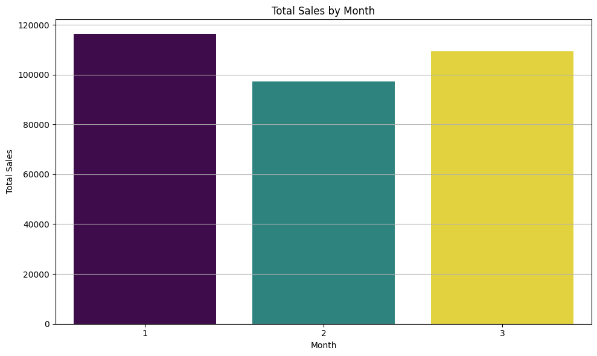
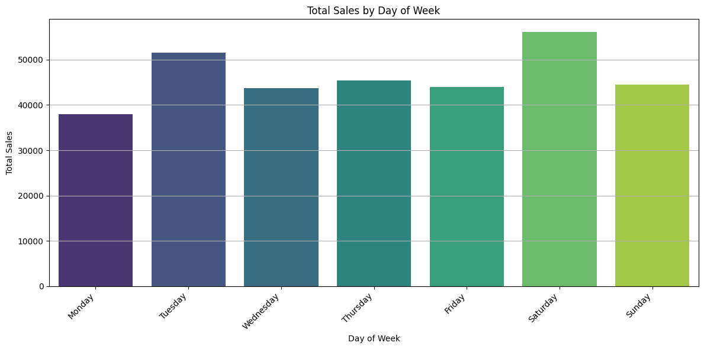
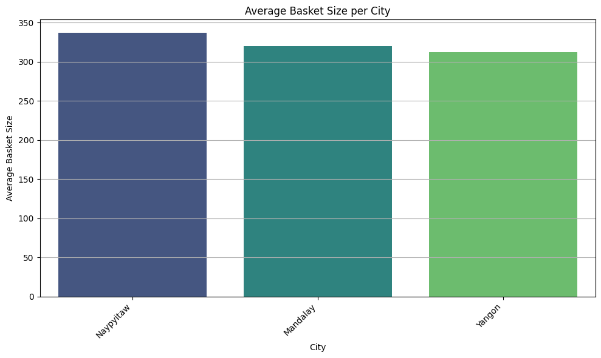
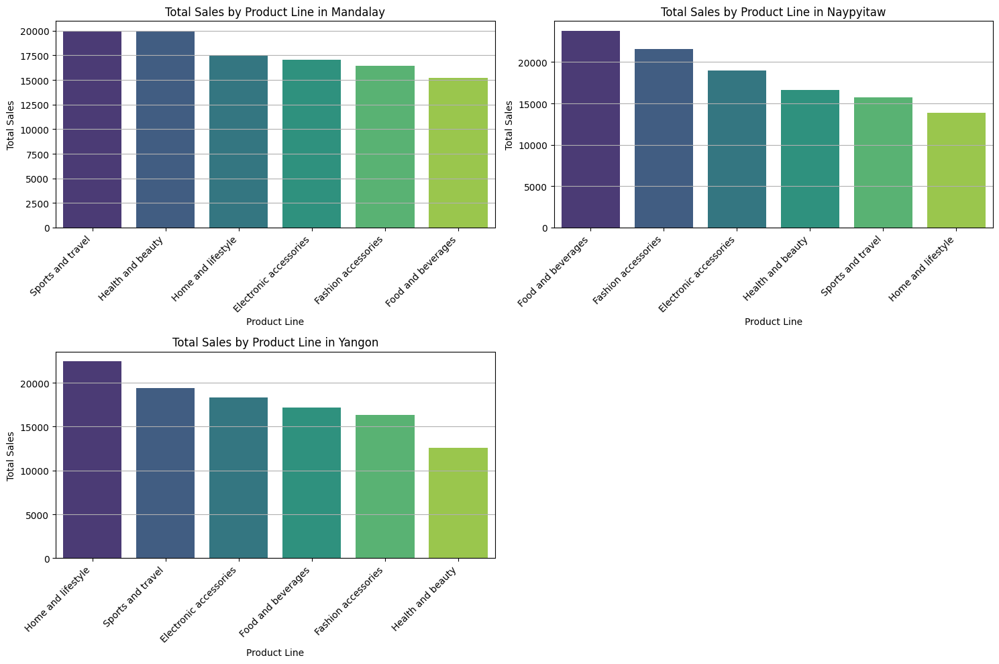
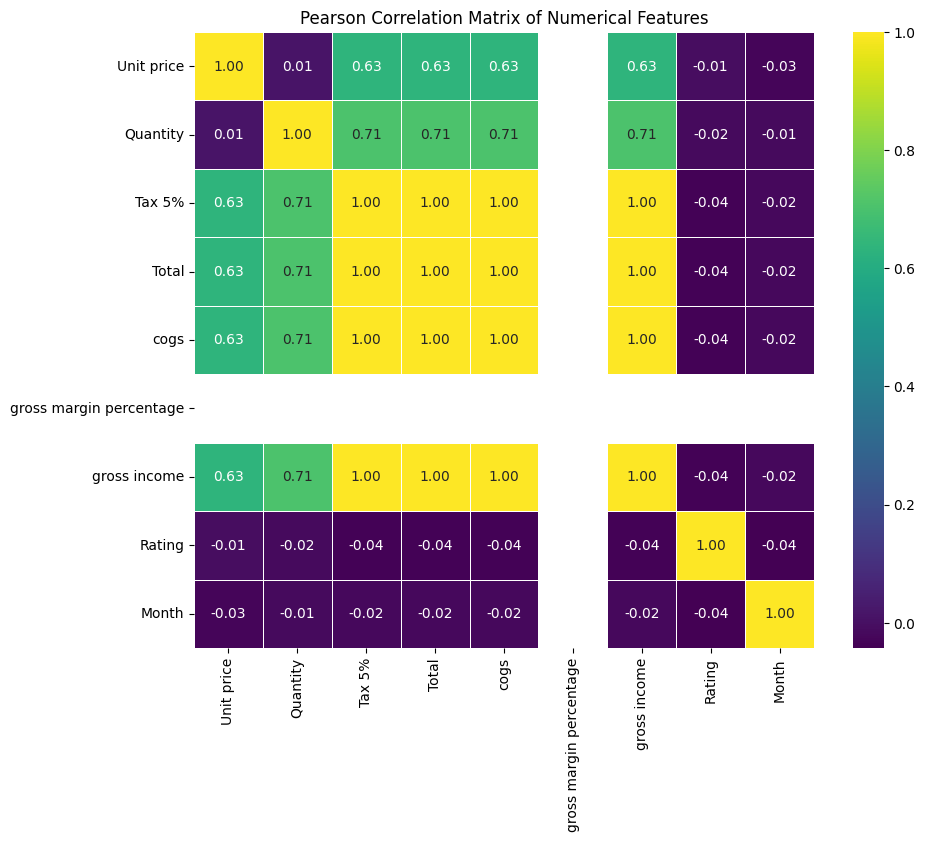

# SALES-ANALYSIS-PORTFOLIO
Analysis of sales patterns, product performance by city, and variable correlations using visualizations and insights.

## Sales Analysis Portfolio Project

## Introduction

This project explores sales performance using multiple metrics to uncover business insights. It includes total sales by day, product performance across cities, monthly sales trends, and average basket size per week. The analysis leverages visualizations to reveal patterns, trends, and correlations, helping inform business planning, marketing strategies, and inventory management.

## Business Problem

Sales performance data is critical for understanding revenue trends, customer behaviour, and regional performance.
The objective of this analysis is to evaluate sales trends over time, identify high-performing regions and product categories, and uncover patterns that support data-driven business decisions.

This analysis helps stakeholders understand where sales are strongest and where opportunities for improvement may exist.

## Dataset Description

The dataset used in this project is the Superstore sales dataset, which contains transactional sales records.

Each row represents an individual sales order, with details on customers, products, locations, and order dates.

## Key features include:

Order Date

Sales

Quantity

Category and Sub-Category

Region and State

## Customer Segment

The dataset supports analysis of sales trends, customer behaviour, and regional performance.

## Data Cleaning

Prior to analysis, the dataset was reviewed to ensure accuracy and suitability for analysis.

## 1. Initial Inspection

The dataset was inspected to understand its structure, data types, and overall size.

## 2. Data Readiness

The dataset was filtered to include relevant time periods used in the analysis. No further cleaning or transformation was required.

## 3. Analysis Preparation

The cleaned dataset was used for exploratory analysis and visualisation to ensure consistent and reliable results.

- Product popularity varies by city, highlighting the need for targeted marketing and stocking strategies.  
- Correlations between variables reveal patterns that can inform forecasting and decision-making.Visualizations & Analysis
- 
## Total Sales by Day of the Week

Weekends consistently generate higher sales, while weekdays are lower. This insight helps with staffing decisions and targeted promotions.

Total Sales by Product in Mandalay, Naypyitaw, and Yangon

Product popularity varies across cities. For example, Yangon leads in certain products while Mandalay favors others. This informs regional inventory planning and marketing strategiesTotal Sales by Month (Calculated and Visualised)

Monthly sales trends highlight peak and low periods, supporting forecasting, promotional planning, and revenue analysis.

Average Basket Size per Week

Weekly basket size changes reveal customer purchasing behavior, helping identify peak shopping periods and optimize promotions or stock levels.

## Exploratory Data Analysis

Exploratory Data Analysis was conducted to evaluate sales performance across time, regions, and product categories.

Sales trends were analysed over multiple years to identify growth patterns and seasonal fluctuations.

Performance was compared across regions to identify high- and low-performing areas.

Product categories and sub-categories were explored to understand their contribution to overall sales.

Customer segments were analysed to assess purchasing behaviour. Sales Calculation Statement (Portfolio-Ready)

Sales values were aggregated across time periods, regions, and product categories to support analysis of trends and performance. This ensured a clear understanding of where sales are highest and how they vary over time.---### Total Sales by Month (Calculated and Visualised)

> Shows monthly sales trends, highlighting peaks and troughs to guide business planning and forecasting.

## Total Sales by Day of the Week
  
> Analysis shows Tuesdays and Saturdays have higher sales, while the rest of the days are slightly lower, helping guide staffing and promotions.

## Average basket size per week 
-
> This visualization shows how the average basket size changes each week, helping identify peak shopping periods and optimize promotions or stock levels--

## Total Sales by Product in Madalay, Naypyitaw, and Yangon
  
> Different cities have varying top-selling products. Yangon leads in certain products, Mandalay favours others. This informs inventory and marketing strategies.

## Correlation Matrix Heatmap
  
> The heatmap reveals relationships between variables, identifying strong correlations and potential multicollinearity, supporting deeper analysis.

## Key Insights

Weekends show higher sales, reflecting customer shopping patterns.

Product preferences differ by city, emphasizing the need for targeted marketing and inventory management.

Monthly sales trends provide clear peaks and troughs, useful for forecasting and planning.

Changes in average basket size help understand customer behaviour and optimise promotions.

## Conclusion
This project demonstrates the use of **data visualization and analysis** to derive actionable business insights. By combining day-of-week trends, city-level product analysis, and variable correlations, the project provides a clear understanding of sales dynamics, making it a strong portfolio example.
